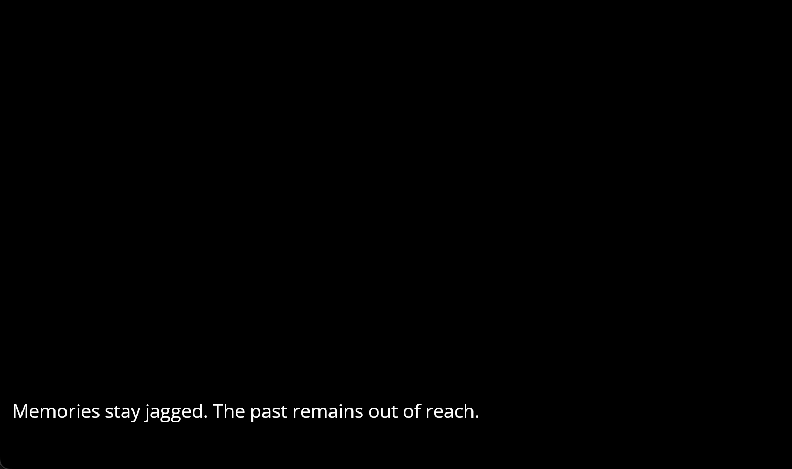

# Reunion

Author: Dante Liang

Design: A quick game about interesting and non-interesting choices. Whether choices matter depends upon the reader's narrative intake.

Text Drawing: Line rendering is done on-the-fly in the game's runtime. The hb-ftt.cpp file is responsible for creating glyphs and positions using Harfbuzz and Freetype given dynamic inputs of lines of text. Then the game runtime in PlayMode.cpp, with help from shaders in TextureProgram.cpp creates textures off of these units and put it on screen.

Choices: Choices are packed into pre-defined game states that resemble a directed graph. Narrative and choice relate to a state and its outgoing edges. They are computed in a helper file GameModel.cpp in a somewhat clean layout.

Screen Shot:

How To Play:

Make choices with w,a,d. There are three possible endings to explore.

Sources: None. Referenced code is cited in comments above corresponding code blocks.

This game was built with [NEST](NEST.md).

